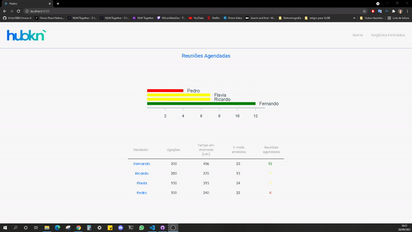
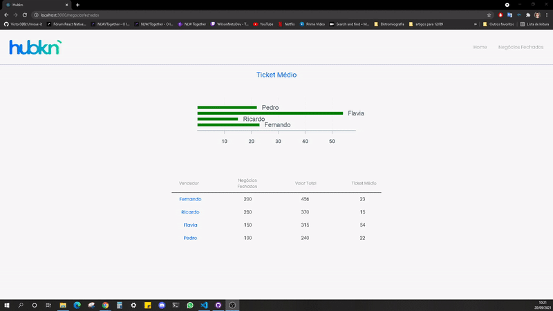

# Hubkn

<p align="center">

</p>

&nbsp;&nbsp;&nbsp;&nbsp;&nbsp;&nbsp;&nbsp;&nbsp;&nbsp;&nbsp;&nbsp;&nbsp;Aplicativo desenvolvido em typescript utilizando React.js. Consiste na aquisição de dados na apresentação de dados por meio de gráficos e tabelas.

## 📡 Api

### Axios
```javascript
import axios from 'axios';

const api = axios.create({
	baseURL: 'http://localhost:8081'
	//altere a string a cima pelo endereço ip da api 
	//baseURL: 'http://xxx.xxx.xxx.x:8081'
});

api.defaults.timeout = 500;

export { api };
```

### Firebase
```javascript
import firebase from 'firebase/app';

import 'firebase/auth';
import 'firebase/database';

const firebaseConfig = {
  apiKey: process.env.REACT_APP_API_KEY,
  authDomain: process.env.REACT_APP_AUTH_DOMAIN,
  databaseURL: process.env.REACT_APP_DATABASE_URL,
  projectId: process.env.REACT_APP_PROJECT_ID,
  storageBucket: process.env.REACT_APP_STORAGE_BUCKET,
  messagingSenderId: process.env.REACT_APP_MESSAGING_SENDER_ID,
  appId: process.env.REACT_APP_APP_ID
};

firebase.initializeApp(firebaseConfig);

export const auth = firebase.auth();
export const database = firebase.database();
```
## 💻 Ambiente

&nbsp;&nbsp;&nbsp;&nbsp;&nbsp;&nbsp;&nbsp;&nbsp;&nbsp;&nbsp;&nbsp;&nbsp; Instale as dependências para iniciar o projeto

```
npm install
```
```
yarn start
```
Ferramentas | versão
:---        | ---:
node        | 15.7.0
yarn        |1.22.10


## ⚙ Bibliotecas

Biblioteca                  | Versão
:---                        | ---:
@testing-library/jest-dom   |@5.14.1                                                 
@testing-library/react      |11.2.7                                              
@testing-library/user-event |12.8.3                                                   
@types/jest                 |26.0.24                                    
@types/node                 |12.20.25                                     
@types/react                |17.0.21                                     
@types/react-dom            |17.0.9                                        
@types/react-router-dom     |5.1.9                                              
@types/styled-components    |5.1.14                                                
axios                       |0.21.4                             
firebase                    |8.6.8                               
node-sass                   |5.0.0                                
react                       |17.0.2                             
react-dom                   |17.0.2                                 
react-router-dom            |5.3.0                                       
react-scripts               |4.0.3                                    
styled-components           |5.3.1                                        
typescript                  |4.4.3                                 
victory                     |36.0.1                               
web-vitals                  |1.1.2

## 📁 Diretório
```javascript
MyGPS-Tracking
  ╚═src
     ╠═index.js
     ╠═ App.tsx
     ╟─assets
     ║  ├─ logo.svg
     ╠═components
     ║  ╠═ Header
     ║  ║  ├─ index.tsx
     ║  ║  └─ styles.ts
     ║  ╠═ HeaderButton
     ║  ║  ├─ index.tsx
     ║  ║  └─ styles.ts
     ║  ╠═ Sheet
     ║  ║  └─ index.tsx
     ║  ║  └─ styles.ts
     ║  ╠═ ResumeSheet
     ║  ║  └─ index.tsx
     ║  ║  └─ styles.ts
     ║  ╠═ SheetRow
     ║  ║  └─ index.tsx
     ║  ║  └─ styles.ts
     ║  ╚═ ResumeSheetRow
     ║     ├─ index.tsx  
     ║     └─ styles.ts 
     ╟─contexts
     ║  └─ chartDataContext
     ║       └─ index.tsx
     ╠═pages
     ║  ╠═ Home
     ║  ║  ├─ index.tsx
     ║  ║  └─ styles.ts
     ║  ╚═ NegociosFechados
     ║     ├─ index.tsx
     ║     └─ styles.ts     
     ╟─services
     ║  ├─ firebase.ts
     ║  └─ api.ts
     ╚═styles
        └─ global.scss
```

## 🏠 Home

<p align= "center">

</p>

## 📈 NegociosFechados

<p align= "center">

</p>
